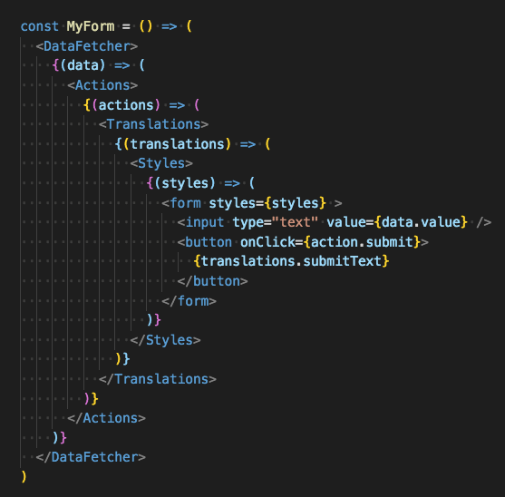

import { Head, Code, Appear, components as Components } from 'mdx-deck'
import { FullscreenCode, Split, SplitRight } from 'mdx-deck/layouts'
import ImageWithLabel from './components/image-with-label'

export { default as theme } from './theme'

<Head>
  <title>React Hooks</title>
</Head>


# React Hooks

Author: Grzegorz Rozdzialik

https://github.com/Gelio/react-hooks-workshop

---

## Agenda

1. What are React Hooks?
2. Kinds of hooks
3. Rules of hooks
4. Adding functionality (**class** vs **function** components)
5. Code challenges

[Docs on Hooks](https://reactjs.org/docs/hooks-intro.html)

https://reactjs.org/docs/hooks-intro.html

---

## What are React Hooks?

- a way to add functionality to function components
- a measure for easy code reuse between components
- a new mental model for creating React components
- a way of Facebook saying FU to class components 😄

Most importantly: they have already been released in `react@16.8.0` (on 2/6/2019)

---

## Rationale

1. Sharing stateful logic between components is hard

<ImageWithLabel label="Nesting render props">
  
</ImageWithLabel>

```notes
1. One would have to use higher order components or render props

    They have their own problems (i.e. introduce new components into the component tree,
    problems with typing in Typescript)

    Moreover copying and pasting code that uses component's state required dilligence
    and copying code from multiple sources.
```

---

## Rationale (continued)

2. Classes are supposedly confusing to developers

- `this` and binding
- not minified well
- components cannot be folded (with `prepack`)
- verbose

```notes

2. Public/private members, methods vs properties, binding functions, knowing and remembering how
    `this` works - it adds up.
```

---

## Kinds of hooks

1. `useState`
2. `useEffect`
3. `useContext`
4. `useReducer`
5. `useMemo`
6. `useCallback`
7. `useRef`
8. ...

---

### `useState`

A way to add state to a function component.

```ts
const [state, setState] = useState('default value')
```

```tsx
function MyStatefulComponent(props) {
  const [counter, setCounter] = useState(0)

  return (
    <>
      <p>Current value: {counter}</p>
      <button onClick={() => setCounter(value + 1)}>Increment</button>
    </>
  )
}
```

```notes
Use array destructuring to name the returned values in any way you want
```

---

### `useState` continued

Can be used multiple times for different pieces of state

```ts
function MyStatefulComponent(props) {
  const [name, setName] = useState('')
  const [surname, setSurname] = useState('')
  const [age, setAge] = useState(0)
}
```

---

### `useState` continued

Objects can be stored, but are replaced when using `setState`

```tsx
function MyComponent() {
  const [state, setState] = useState({ name: '', surname: '' })

  if (Math.random() > 0.5) {
    setState({
      // Notice that `state` is spread here
      ...state,
      name: 'New name',
    })
  }

  // ...
}
```

---

### `useEffect`

- runs upon every render (although it can be controlled)
- replaces `componentDidMount`, `componentDidUpdate`
- used to make network requests, subscribe to events etc.

```tsx
function MyComponent() {
  useEffect(() => {
    console.log('Component has mounted/updated')
  })
}
```

---

### `useEffect` continued

How to cancel network requests/subscriptions?

```tsx
function MyComponent() {
  useEffect(() => {
    const cancelableRequest = uberFetch()

    return () => {
      cancelableRequest.cancel()
    }
  })
}
```

```notes
Will make the request every time the component is updated
```

---

### `useEffect` continued

Control when `useEffect` is run by providing an array of dependencies

```tsx
function MyComponent(props) {
  useEffect(() => {
    const cancelableRequest = uberFetch(props.userId)

    return () => {
      cancelableRequest.cancel()
    }
  }, [props.userId])
  // The effect will be cleared and run again when `userId` changes
}
```

---

### `useContext`

Access data in the context

```tsx
const MyContext = React.createContext()

function MyComponent() {
  const contextValue = useContext(MyContext)

  // ...
}
```

---

### `useReducer`

Similar to _redux_'s reducers

```tsx
const initialState = { count: 0 }

function reducer(state, action) {
  switch (action.type) {
    case 'increment':
      return { count: state.count + 1 }
    case 'decrement':
      return { count: state.count - 1 }
    default:
      throw new Error()
  }
}
```

---

### `useReducer` continued

```tsx
function Counter({ initialCount }) {
  const [state, dispatch] = useReducer(reducer, initialState)
  const increment = () => dispatch({ type: 'increment ' })
  const decrement = () => dispatch({ type: 'decrement ' })

  return (
    <>
      Count: {state.count}
      <button onClick={increment}>+</button>
      <button onClick={decrement}>-</button>
    </>
  )
}
```

---

### `useMemo`, `useCallback`

A way to memoize some value/callback.

Avoid recomputing it or creating new references on every render.

```tsx
function MyComponent() {
  // value will be computed only once
  const value = useMemo(() => performSomeExpensiveComputation())

  // onButtonClick will be the same reference
  const onButtonClick = useCallback(() => console.log('Button was clicked'))

  return <button onClick={onButtonClick}>{value}</button>
}
```

---

### `useMemo`, `useCallback` continued

Both accept a dependency array, similar to `useEffect`

```tsx
function MyComponent(props) {
  const value = useMemo(() => performSomeExpensiveComputation(props.userId), [
    props.userId,
  ])

  const onButtonClick = useCallback(
    () => console.log('Clicked button for', props.userId),
    [props.userId],
  )

  return <button onClick={onButtonClick}>{value}</button>
}
```

---

### `useRef`

Stores some value for the whole component lifetime

Similar to class component properties

Can be used for component refs, but not only that

```tsx
function MyComponent() {
  const ref = useRef()
  useEffect(() => {
    ref.current.focus()
  }, [])

  return <input ref={ref} />
}
```

---

## Rules of hooks

1. Hooks should be called always in the same order (no `if`s, loops, etc.)
2. Hooks should be called only in **function components** or **custom hooks**

Suggestion: prefix custom hooks with `use`, e.g. `useCustomFeature`

Rules enforced by [eslint-plugin-react-hooks](https://www.npmjs.com/package/eslint-plugin-react-hooks)
and [tslint-react-hooks](https://github.com/Gelio/tslint-react-hooks).

---

### Fun fact about `@types/react`

```ts
type ComponentType<P = {}> = ComponentClass<P> | FunctionComponent<P>

// ...

/**
 * @deprecated as of recent React versions, function components can no
 * longer be considered 'stateless'. Please use `FunctionComponent` instead.
 *
 * @see [React Hooks](https://reactjs.org/docs/hooks-intro.html)
 */
type StatelessComponent<P = {}> = FunctionComponent<P>
```

---

## Adding functionality (**class** vs **function** components)

Starting with the following component

```tsx
function User({ id, name }) {
  return <div>{name}</div>
}
```

---

#### Add fetching a number of user's stars (pre-hooks)

1. Convert a component into a class component
2. Add a piece of state for the request status and number of stars
3. Initiate the request in `componentDidMount`
4. (optional) cancel the request in `componentWillUnmount`

---

#### Add fetching a number of user's stars (with hooks)

```tsx
function User({ id, name }) {
  const [stars, setStars] = useState()
  useEffect(() => {
    const cancelableRequest = fetchUserStars(id).then((fetchedStars) =>
      setStars(fetchedStars),
    )

    return () => {
      cancelableRequest.cancel()
    }
  }, [id])

  return <div>{name}</div>
}
```

```notes
Let's come back to the class component implementation
```

---

#### Add fetching a number of user's stars (pre-hooks)

1. Convert a component into a class component
2. Add a piece of state for the request status and number of stars
3. Initiate the request in `componentDidMount`
4. (optional) cancel the request in `componentWillUnmount`

Spotted a bug?

---

#### Add fetching a number of user's stars (pre-hooks)

1. Convert a component into a class component
2. Add a piece of state for the request status and number of stars
3. Initiate the request in `componentDidMount`
4. (optional) cancel the request in `componentWillUnmount`

What if `id` changes?

The request for previous id is not cancelled and a new one is not issued.

---

#### Add fetching a number of user's stars (pre-hooks)

1. Convert a component into a class component
2. Add a piece of state for the request status and number of stars
3. Initiate the request in `componentDidMount`
4. (optional) cancel the request in `componentWillUnmount`
5. **(optional) add cancelling and initialing requests in `componentDidUpdate`**

---

## Questions

---

Thank you for your participation.
